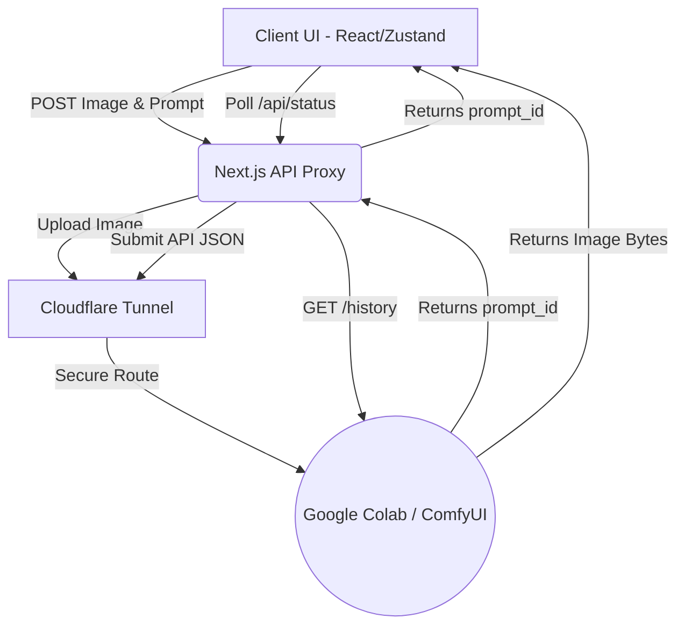

# Photobe | AI Background Compositor

Photobe Studio is a headless AI compositing prototype designed for e-commerce sellers. It allows users to upload a raw product snapshot and generate photorealistic, high-resolution commercial lifestyle assets in seconds using a decoupled Stable Diffusion backend.

Built as a time-boxed weekend prototype to explore Next.js Server Components, headless AI integration, and asynchronous queue management.

---

## Tech Stack

`Next.js (App Router)` · `React` · `Zustand` · `TypeScript` · `shadcn/ui` · `ComfyUI` · `Stable Diffusion 1.5` · `Cloudflare Tunnel`

---

## 🎯 The Problem

Third-party e-commerce sellers need high-quality "lifestyle" imagery for product listings to drive conversion. Traditional studio photography requires expensive lighting gear, location scouting, and significant time.

**The solution:** a web-based tool that accepts a zero-cost, raw smartphone photo of a product (e.g., a water bottle on a desk) and uses generative AI to composite it into a cinematic, photorealistic environment based on a simple text prompt.

---

## 🏗️ System Architecture

To ensure enterprise-grade security and bypass frontend serverless timeout limits, the architecture strictly separates the client interface from the AI inference engine.

> **Note:** this is intentionally ephemeral infrastructure for a time-boxed prototype (see [Ephemeral GPU Infrastructure](#3-ephemeral-gpu-infrastructure) below). A production version would run the inference backend on a persistent service like AWS EC2 or SageMaker behind the same API proxy — the frontend would require zero changes to make that swap.



### Component Structure & Data Flow

The Next.js App Router is used to separate server logic from client interactivity, minimizing the JavaScript bundle size.

```
/app
├── page.tsx              # Home page (Marketing Landing Page - Framer Motion)
├── /studio/page.tsx      # Server Component: Static Layout Grid
├── /api
│   ├── /generate/route.ts  # Proxy: Maps user input to ComfyUI JSON graph
│   ├── /status/route.ts    # Proxy: Polls ComfyUI queue status
│   └── /image/route.ts     # Proxy: Securely fetches final image buffer
/components
├── /ui
│   ├── button.tsx        # shadcn: button
│   ├── card.tsx          # shadcn: card
│   ├── input.tsx         # shadcn: input
│   └── skeleton.tsx      # shadcn: skeleton
├── Controls.tsx          # Client Component: Dropzone, API dispatcher
├── Preview.tsx           # Client Component: Output display, rendering states
├── LandingPage.tsx       # Client Component: Marketing Landing Page
├── Header.tsx            # Server Component: Header with logo and nav
├── Footer.tsx            # Server Component: simple footer
/store
└── useStore.ts           # Zustand: Decoupled state for cross-component data
/lib
└── utils.ts              # Image resize utility function
```

---

## 🧠 Key Design & Technical Decisions

### 1. The Next.js API Proxy

The React frontend never communicates directly with the AI backend. All requests are routed through Next.js Server Routes.

**Why:** This hides the backend GPU infrastructure's IP, eliminates CORS issues, and offloads the heavy JSON graph construction to the server. If the ComfyUI backend is swapped for AWS Bedrock or SageMaker in the future, the frontend code requires zero changes.

### 2. Asynchronous Polling

Standard Vercel serverless functions time out after 10 seconds. AI image generation takes ~15–20 seconds.

**Why:** Instead of keeping an HTTP request open until it crashes, the `/api/generate` route returns a job ID instantly. The client uses `setInterval` to ping `/api/status` every 2 seconds. This gracefully handles long-running GPU tasks without triggering gateway timeouts.

### 3. Ephemeral GPU Infrastructure

Rather than provisioning an expensive, always-on AWS EC2 instance for a weekend prototype, the backend runs on a free Google Colab T4 GPU.

**Why:** By running ComfyUI inside Colab and exposing it via a `cloudflared` tunnel, this creates a zero-cost, ephemeral backend that connects to the production Vercel frontend without any always-on hosting cost. The tradeoff is explicit: this is a deliberate prototyping shortcut, not the intended production architecture.

### 4. Client-Side Asset Optimization

High-resolution smartphone photos (4K+) cause out-of-memory (OOM) crashes on 16GB GPUs when converting to latent space.

**Why:** Implemented an HTML5 Canvas interceptor inside `Controls.tsx`. When a user uploads a large image, the browser silently downscales it to a 768px lossless PNG before sending it over the network. This eliminates backend OOM crashes and reduces upload latency by ~90%.

### 5. Loading States

`skeleton.tsx` (shadcn) is used to render placeholder states during the 15–20 second generation window rather than a blank screen or spinner-only state, giving users a clearer sense of layout and progress while waiting.

---

## 🚀 Future Vision: V2 Architecture

The current V1 prototype uses a global Img2Img Stable Diffusion 1.5 pipeline. The limitation of this approach is the global denoise tradeoff: low denoise preserves the product but yields poor backgrounds, while high denoise yields photorealistic backgrounds but mutates the product's shape/branding.

**V2 roadmap:**

- **Automated masking** — integrate a Segment Anything (SAM) node to automatically isolate the product silhouette
- **Inpainting + ControlNet** — apply full denoise only to the masked background area, keeping the product mask untouched. Combine this with a Depth ControlNet to generate accurate environmental shadows and reflections around the base of the untouched product
- **Upscaling pass** — add a Real-ESRGAN or similar upscale node to reach genuine high-resolution output for commercial use

---

## 🛠️ Setup & Local Development

### 1. Boot the AI backend (Google Colab)

Open a new Google Colab notebook and set Runtime to T4 GPU.

Run the following cell to install ComfyUI and Cloudflare:

```bash
!git clone https://github.com/comfyanonymous/ComfyUI
%cd ComfyUI
!pip install -r requirements.txt
!wget -c https://huggingface.co/runwayml/stable-diffusion-v1-5/resolve/main/v1-5-pruned-emaonly.safetensors -P ./models/checkpoints/
!wget -q https://github.com/cloudflare/cloudflared/releases/latest/download/cloudflared-linux-amd64.deb
!dpkg -i cloudflared-linux-amd64.deb
```

Run ComfyUI in the background and launch the tunnel:

```python
import os, time
os.system("nohup python main.py > comfy.log 2>&1 &")
time.sleep(5)
!cloudflared tunnel --url http://127.0.0.1:8188
```

Copy the `.trycloudflare.com` URL from the output.

### 2. Run the frontend (Next.js)

Clone this repository, then:

```bash
npm install
```

Create a `.env.local` file in the root directory and add the Cloudflare URL:

```
COMFYUI_URL=https://your-cloudflare-url.trycloudflare.com
```

Start the development server:

```bash
npm run dev
```

Navigate to `http://localhost:3000` to view the landing page and access the studio.
